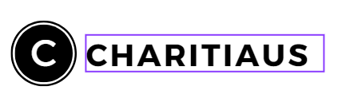

## Hey 👋, I'm MD.TAJUL ISLAM TANVIR!

  
Hi there! I'm MD Tajul Islam Tanvir, and I've been learning to code for three years now. For the last 1.5years, I've been working at SISCOTEK, where I've been getting better at making websites. I did some courses on Programming Hero to learn more about web development, and now I can make cool websites. I'm always trying to get better at what I do and learn new things. Let's chat and see how we can make something awesome together!🛠️.
 
 

  
### 🧐 More About Me:

- 🔭 &nbsp; I’m currently working on **[SISCOTEK](https://siscotek.com/)** as junior web Developer.
- 👀 &nbsp; I’m passionate about continuous learning and exploring new technologies.
- 🌱 &nbsp; I’m currently honing my coding skills. 
- 👨🏻‍💻 &nbsp; Most of my projects are available on [Github](https://github.com/MD-TANVIR7462?tab=repositories)
- 💬 &nbsp; Ask me about anything tech related, I am happy to help;
- 📫 &nbsp; Reach me at mdtanvir7462@gmail.com.
- 📫 &nbsp; Feel free to ping me on [LinkedIn](https://www.linkedin.com/in/md-tajul-islam-tanvir-531682278/)
- 📝 &nbsp; Checkout my [resume](https://drive.google.com/file/d/1f8eXEB7NzP9-uXosEdq_yUnbS49pBCjj/view?usp=drive_link)
- 👀 &nbsp; Portfolio: [Visit my portfolio](https://tajulislam.netlify.app/)

 

### 🔨 Languages and Tools:

 

### 📈 GitHub Stats 

### GitHub Streak

 
 

### 🛠️ My Projects

